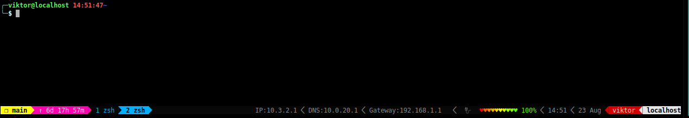

# Tmux settings

My `tmux` settings are based on [`gpakosz`'s Oh-My-Tmux](https://github.com/gpakosz/.tmux) and I've added/changed some of the settings to better suite my taste.

# Installation

Download and run [`setup.sh`](https://raw.githubusercontent.com/ViktorBarzin/dot_files/master/setup.sh):

```bash
curl -sL https://raw.githubusercontent.com/ViktorBarzin/dot_files/master/setup.sh | bash
```

It will install `tmux` and `zsh` if missing and `wget` all the config files.


# Everyday hacks
Shortcuts I use every day.
I find all of these shortcuts improve my typing speed and hence my productivity.

They are focused around either 1) reduce the distance my fingers have to move or 2) shorten commonly written commands


## tmux
| Feature                  | Shortcut                                                                                                                                               |
|--------------------------|--------------------------------------------------------------------------------------------------------------------------------------------------------|
| `tmux` Prefix            | `Alt-x`                                                                                                                                                |
| text selection           | `Prefix Enter` to enter visual mode, then vim bindings to move, `V` to enter select mode and once happy with selection `Enter` to copy to OS clipboard |
| Vertical split pane      | `Prefix \`                                                                                                                                             |
| Horizontal pane split    | `Prefix -`                                                                                                                                             |
| Pane movement            | Hold `Alt` and vim movement bindings (or arrows for normies) to move in all directions                                                                 |
| Pane resize              | `Prefix` and vim movement                                                                                                                              |
| Maximize current pane    | `Prefix z` (z for zoom)                                                                                                                                |
| Toggle synchronize panes | `Prefix s` (s for synchronize)                                                                                                                         |
| New window               | `Prefix c` (c for create)                                                                                                                              |
| Go to previous window    | `Prefix Tab` (similar to Alt-Tab)                                                                                                                      |
| Go to window number `n`  | `Prefix n` where n is the window number (window numbers are in status line)                                                                            |
| Rename window            | `Prefix ,`                                                                                                                                             |
| Edit a long command line | `Ctrl-x Ctrl-e` , this is more bash-y rather than tmux                                                                                                 |

To edit the status line, edit `tmux_conf_theme_status_left` and `tmux_conf_theme_status_right` in `tmux.conf.local`.

## zsh aliases

A full list of all aliases can be seen in the [.bash_aliases file](https://raw.githubusercontent.com/ViktorBarzin/dot_files/master/.bash_aliases).

Here are some of the highlights I tend to use more often:

| Alias                              | Command                                                                                                                                                                                                                                        | Comment                                                                                                         |
|------------------------------------|------------------------------------------------------------------------------------------------------------------------------------------------------------------------------------------------------------------------------------------------|-----------------------------------------------------------------------------------------------------------------|
| `s`                                | `ssh`                                                                                                                                                                                                                                          |                                                                                                                 |
| `a`                                | `sudo atop`                                                                                                                                                                                                                                    | `sudo` is used to get full overview                                                                             |
| `h`                                | `sudo htop`                                                                                                                                                                                                                                    | ^                                                                                                               |
| `myip`                             | `curl icanhzip.com`                                                                                                                                                                                                                            | Get your public/global IPv4/IPv6 address                                                                        |
| `dk`                               | `docker`                                                                                                                                                                                                                                       | 76.7% performance increase ;)                                                                                   |
| `dkon`                             | `sudo systemctl start docker`                                                                                                                                                                                                                  |                                                                                                                 |
| `dkoff`                            | `sudo systemctl stop docker`                                                                                                                                                                                                                   |                                                                                                                 |
| `kb`                               | `kubectl`                                                                                                                                                                                                                                      | Massive perf increase if you are a k8s user                                                                     |
| `kubectl get pods`                 | `kbp`                                                                                                                                                                                                                                          |                                                                                                                 |
| `kn`                               | `kubens`                                                                                                                                                                                                                                       | Switch k8s namespaces to avoid writing `-n some_namespace` all the time                                         |
| `g`                                | `git`                                                                                                                                                                                                                                          | 66.7% improvement ;)                                                                                            |
| `gs`                               | `git status`                                                                                                                                                                                                                                   |                                                                                                                 |
| `ga`                               | `git add`                                                                                                                                                                                                                                      |                                                                                                                 |
| `gc`                               | `git commit`                                                                                                                                                                                                                                   |                                                                                                                 |
| `gp`                               | `git push origin master`                                                                                                                                                                                                                       |                                                                                                                 |
| `gpull`                            | `git pull --rebase origin master`                                                                                                                                                                                                              | Please always rebase, don't do merge commits...                                                                 |
| `gd`                               | `git diff`                                                                                                                                                                                                                                     |                                                                                                                 |
| `gds`                              | `git diff --staged`                                                                                                                                                                                                                            | Changes that are `add`-ed and will be part of the commit                                                        |
| `gl`                               | `git log --graph --abbrev-commit --decorate --format=format:'%C(bold blue)%h%C(reset) - %C(bold cyan)%aD%C(reset) %C(bold green)(%ar)%C(reset)%C(bold yellow)%d%C(reset)%n''          %C(white)%s%C(reset) %C(dim white)- %an%C(reset)' --all` | A very pretty version of git log                                                                                |
| `git-standup`                      | long function, not included for brevity                                                                                                                                                                                                        | A useful git function to show commits from yesterday that's useful during standups                              |
| `xo`                               | `xdg-open`                                                                                                                                                                                                                                     | Handy way to open any file type                                                                                 |
| `toclip`                           | `xclip -selection clipboard`                                                                                                                                                                                                                   | Usually I do pipe a command to `toclip` to get the output to clipboard                                          |
| `pmr`                              | `python manage.py runserver`                                                                                                                                                                                                                   | Django developers know                                                                                          |
| `nopmr`                            | long line, not included for brevity                                                                                                                                                                                                            | Django crashes from time to time but does not release the binded port which prevents from binding to them again |
| `python manage.py migrate`         | `pmm`                                                                                                                                                                                                                                          |                                                                                                                 |
| `python manage.py make migrations` | `pmmm`                                                                                                                                                                                                                                         |                                                                                                                 |
| `omg`                              | `sudo systemctl restart NetworkManager`                                                                                                                                                                                                        | When `NetworkManager` drives you crazy by crashing often                                                        |
| `omg1.1`                           | `sudo rmmod iwlmvm && sudo rmmod iwlwifi; sudo modprobe iwlwifi`                                                                                                                                                                               | Reload wifi module                                                                                              |
| `root`                             | `sudo su -`                                                                                                                                                                                                                                    | `sudo su` (without the `-`) keeps environment which, in a shared environ, can be dangerous                      |
| `aliases`                          | `vim ~/.bash_aliases && source ~/.bash_aliases`                                                                                                                                                                                                | Convenient way to add new aliases and source them upon exit                                                     |
| `zshrc`                            | `vim ~/.zshrc`                                                                                                                                                                                                                                 | ^                                                                                                               |
| `f`                                | `free -h`                                                                                                                                                                                                                                      | Check memory usage                                                                                              |
| `speedtest`                        | `curl -s https://raw.githubusercontent.com/sivel/speedtest-cli/master/speedtest.py |python -`                                                                                                                                                  | speed test without needing the package installed locally                                                        |
